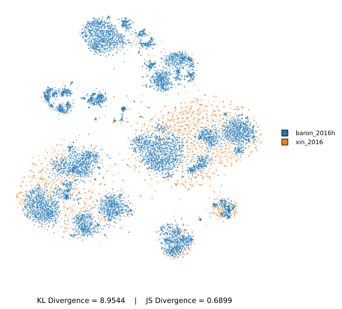
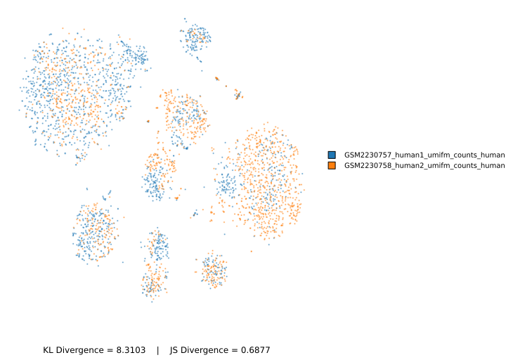

# 🧬 Comparative Analysis of scVI Latent Embeddings Across Pancreatic Tissue Datasets

## Overview

This report presents a comparative analysis of two pairs of **pancreatic single-cell RNA sequencing (scRNA-seq)** datasets processed using **scVI**, with a focus on their **statistical divergence** in the latent space. Divergence was quantified using **Kullback-Leibler (KL)** and **Jensen-Shannon (JS)** metrics.

---

## 🔍 Datasets Compared

These datasets are all derived from **pancreatic tissue**, but represent either different individuals or come from different studies.

### 1. **Baron (2016h)** vs **Xin (2016)**
- **KL Divergence**: `8.9544`
- **JS Divergence**: `0.6899`

### 2. **GSM2230757 (Human1)** vs **GSM2230758 (Human2)**
- **KL Divergence**: `8.3103`
- **JS Divergence**: `0.6877`

---

## 🧪 What Do These Divergence Metrics Mean?

- **KL Divergence** quantifies how much one distribution diverges from another. Higher values mean greater divergence.
- **JS Divergence** is a smoothed, symmetric version of KL, bounded between 0 and 1, where values closer to 1 indicate more significant differences.

---

## 📊 Visualizations

### 🔹 t-SNE Plot: Baron vs Xin

### 🔹 t-SNE Plot: Human1 vs Human2

---

## 📌 Observations & Interpretation

| Dataset Pair                        | KL Divergence | JS Divergence | Interpretation                                  |
|-------------------------------------|---------------|----------------|--------------------------------------------------|
| Baron vs Xin                        | 8.9544        | 0.6899         | Significant divergence; distinct latent profiles |
| Human1 vs Human2                    | 8.3103        | 0.6877         | Slightly lower divergence, but still high        |

These values suggest that even though the datasets all represent **pancreatic tissue**, they show substantial divergence in latent space after scVI integration.

### 🔬 Possible Reasons for High Divergence

- **Inter-individual biological variation**: Different donors may have distinct cellular states even within the same tissue (e.g., variation in endocrine/exocrine composition).
- **Technical batch effects**: scVI attempts to correct for these, but factors like sequencing technology, library prep, or lab protocols can still influence outcomes.
- **Gene filtering mismatch**: Selection of highly variable genes may differ across studies.
- **Cell-type annotation drift**: Slight differences in annotation criteria between datasets may impact label harmonization during filtering.

---

## ✅ Recommendations

1. **Ensure consistent cell-type labeling** to enhance compatibility across datasets.
2. **Experiment with latent dimension settings** (`n_latent`) and network depth for better generalization.
3. Explore **scANVI**, which incorporates label information into the training and may yield better alignment.
4. Consider **per-cell-type divergence metrics** to identify which populations contribute most to divergence.

---

## 📁 Conclusion

Despite originating from the **same tissue type (pancreas)**, the datasets exhibit high divergence in latent space. This suggests strong biological or technical variation that remains even after scVI modeling. Future efforts should focus on deeper harmonization and leveraging supervised methods like scANVI for more robust integration.

